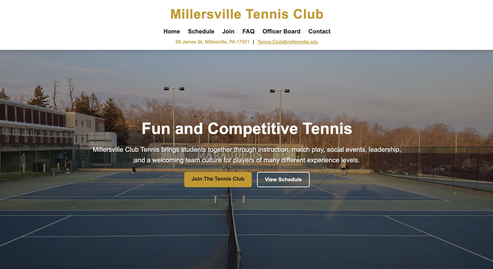
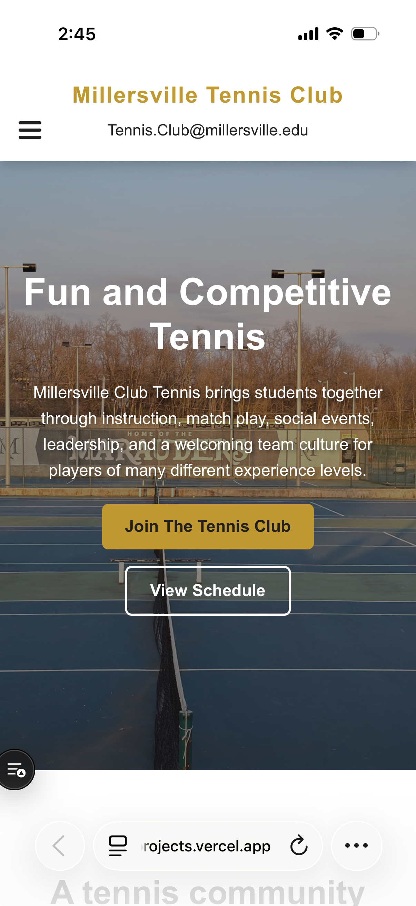
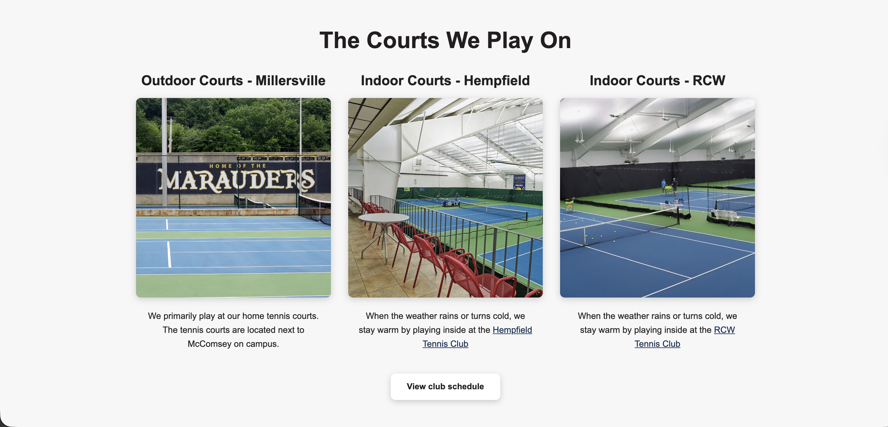
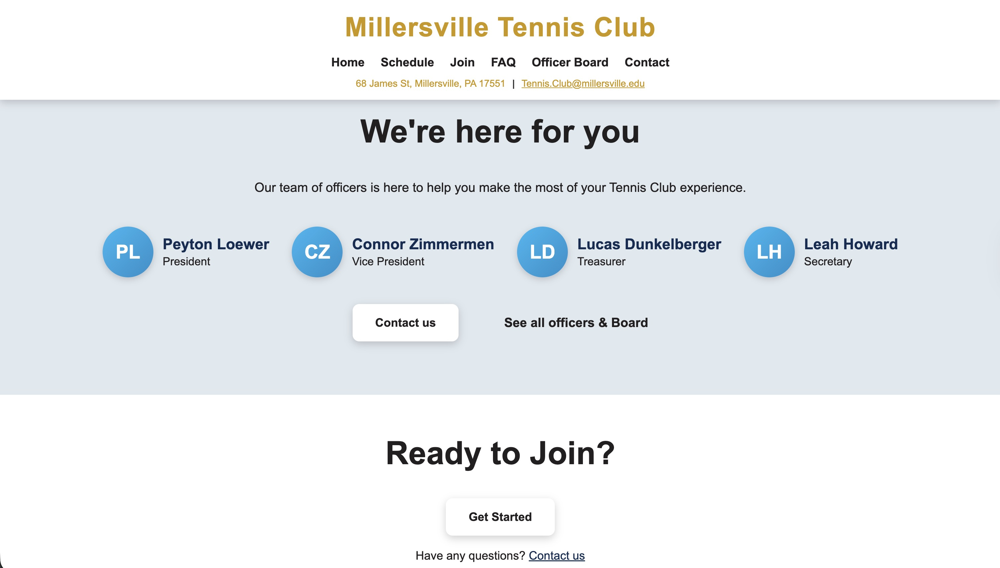

# Millersville Club Tennis Website


---

## Overview

This project is the official website for the Millersville Club Tennis organization. It was designed and developed as a modern, responsive web application to improve the club’s online presence, streamline communication, and provide clear, accessible information to current and prospective members.

The application emphasizes usability, scalability, and maintainability, ensuring that the club can continue to grow and update the site over time with minimal friction.

--- 

## 🌐 Live Demo

https://millersville-tennis-club.vercel.app

---

## Screenshots

### Homepage


### Mobile View


### Courts View


### Officers Section


---

## Purpose

The goal of this project is to provide a centralized platform where users can:

- Learn about the club and its mission
- View practice schedules and locations
- Understand how to join the organization
- Contact club leadership
- Stay informed about events and updates

This website also serves as a long-term foundation for future enhancements such as dynamic scheduling, member management, and event tracking.

---

## Tech Stack

**Frontend**
- React (Component-based UI architecture)
- React Router (Client-side routing)
- Vite (Build tool and development server)

**Styling**
- Custom CSS (Responsive design with reusable styles and variables)

**Deployment**
- Vercel (Continuous intergration/deployment and hosting)

---

## Features

### Core Features
- Fully responsive design for desktop, tablet, and mobile
- Dynamic client-side routing (SPA behavior)
- Reusable layout components (Header, Footer)
- Structured page system for scalability

### Homepage
- Hero section with call-to-action
- Club highlights and overview
- Slideshow of club imagery
- Court location section
- FAQ preview
- Officer introduction section

### Navigation & UX
- Mobile-friendly navigation with expandable menu
- Clear page hierarchy and consistent layout
- Accessible links and structured content

### Pages
- Home
- Join (membership overview and onboarding guidance)
- Schedule (practice and event structure)
- FAQ (common questions and answers)
- Officer Board (club leadership)
- Contact (email, location, and social links)

---

## Local Setup

To run the project locally:

### 1. Clone the repository
```bash
git clone <your-repo-url>
cd Millersville-Tennis-Club
```

### 2. Install dependencies
```
npm install
```
### 3. Start development server
```
npm run dev
```
### 4. Open in browser
```
http://localhost:5173
```

---

## Deployment

The application is deployed using Vercel, which provides:
- Continuous deployment from GitHub
- Automatic builds on push
- Preview environments for feature branches
- Production hosting with a global CDN

### Deployment Workflow
- Feature development occurs on separate branches
- Changes are pushed to GitHub
- Vercel automatically generates a preview deployment
- Once approved, changes are merged into the main branch
- Production is updated automatically

---

## Future Enhancements

This project is designed to support future improvements, including:

- Dynamic schedule management (admin-editable content)
- Event calendar integration
- Member registration and tracking system
- Authentication for club officers
- Contact form with backend support
- Blog or announcements section
- Enhanced animations and UI interactions
- SEO optimization and analytics integration

---

## Author

**Antonio Corona**
B.S. Computer Science — Millersville University

- GitHub: https://github.com/antonioc-26
- Portfolio: https://antonioc-26.github.io/
- LinkedIn: https://linkedin.com/in/antonioc26

---

## Notes for Client

- This website is built to be easily extendable
- Content updates can be made through code or future admin tooling
- The structure supports long-term growth and feature expansion
- Deployment is automated through Vercel for reliability and ease of updates